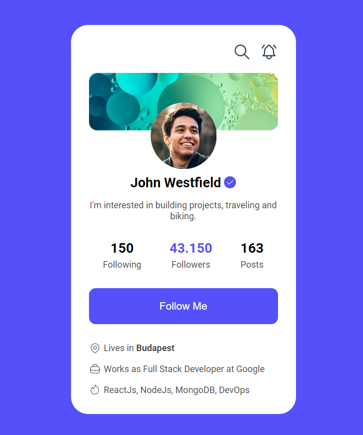
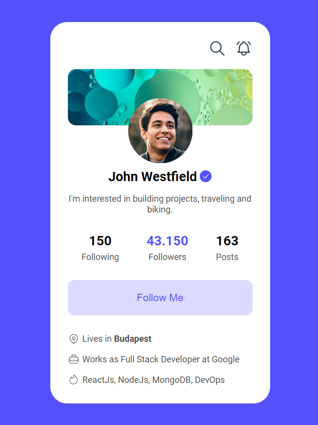

# Web Developer Mentor - Profile Widget solution

This is a solution to the [Notifications menu challenge on Web Developer Mentor](https://webdevelopermentor.com/challenges/profile-widget/center).

## Table of contents

- [Overview](#overview)
  - [The challenge](#the-challenge)
  - [Screenshot](#screenshot)
  - [Links](#links)
- [My process](#my-process)
  - [Built with](#built-with)
- [Author](#author)

## Overview

### The challenge

In this challenge, you'll create a profile notification widget. It contains a header background with an avatar, profile statistics, and links.

### Screenshot

### Links

- Solution URL: [View code](https://github.com/purnimakumarr/web-developer-mentor/tree/main/02-Profile-Widget)
- Live Site URL: [View site](https://profile-widget-purnima.netlify.app)

## My process

### Built with

- Semantic HTML5 markup
- CSS custom properties
- CSS Flexbox

## Author

- Website - [Purnima Kumar](https://purnimakumarr.github.io/)
- Twitter - [@purnimakumarr](https://www.twitter.com/purnimakumarr)
